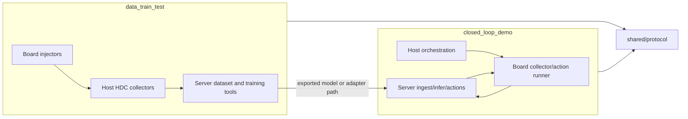
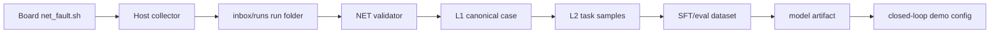
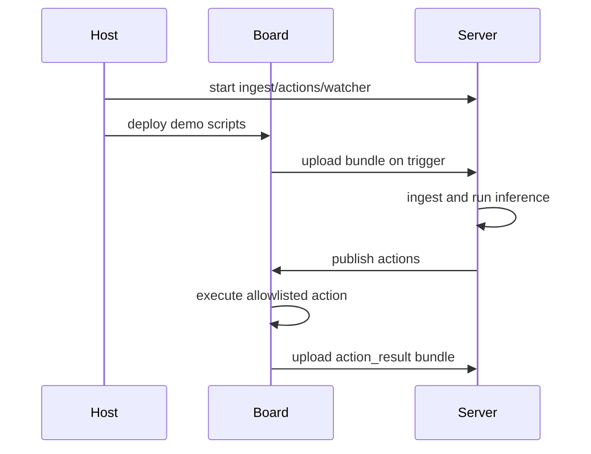

# Architecture

## Runtime Lines

## Data/train/test Flow

## Closed-loop Demo Flow

## Boundaries

- Board code must remain BusyBox/Toybox compatible and must not require `awk` or
  `tr`.
- Host code owns Windows PowerShell, HDC target resolution, and SSH/SCP
  orchestration.
- Server code owns Python ingest, inference orchestration, watcher loops, and
  model/runtime paths.
- `shared/` is only for stable protocols and common schemas used by both lines.
